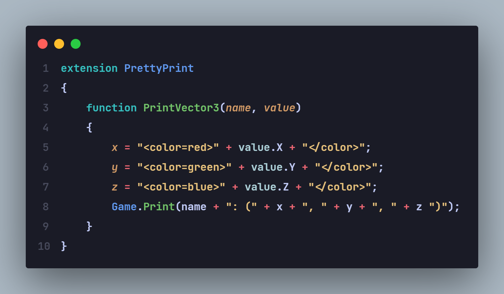

# What?

Simple extension that enables syntax highlighting for aottg custom logic (.acl) files
and adds some code snippets.

# Install

To install, simply clone the repo, extract the content to `<user home>/.vscode/extensions`

# Snippets

- `print`
- `for`
- `foreach`
- `while`
- `class`
- `extension`
- `cutscene`
- `Init()`
- `OnGameStart()`
- `OnTick()`
- `OnFrame()`
- `OnSecond()`
- `OnChatInput()`
- `OnPlayerSpawn()`
- `OnCharacterDie()`
- `OnCharacterDamaged()`
- `OnPlayerJoin()`
- `OnPlayerLeave()`
- `OnNetworkMessage()`
- `OnCollisionEnter()`
- `OnCollisionStay()`
- `OnCollisionExit()`
- `OnGetHit()`
- `OnNetworkTransfer()`
- `SendNetworkStream()`
- `OnNetworkStream()`
- `function`
- `ToString()`
- `RandomFloat()`
- `FindMapObjectByName()`
